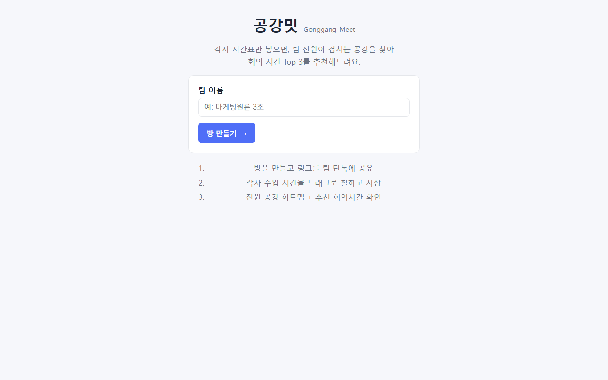
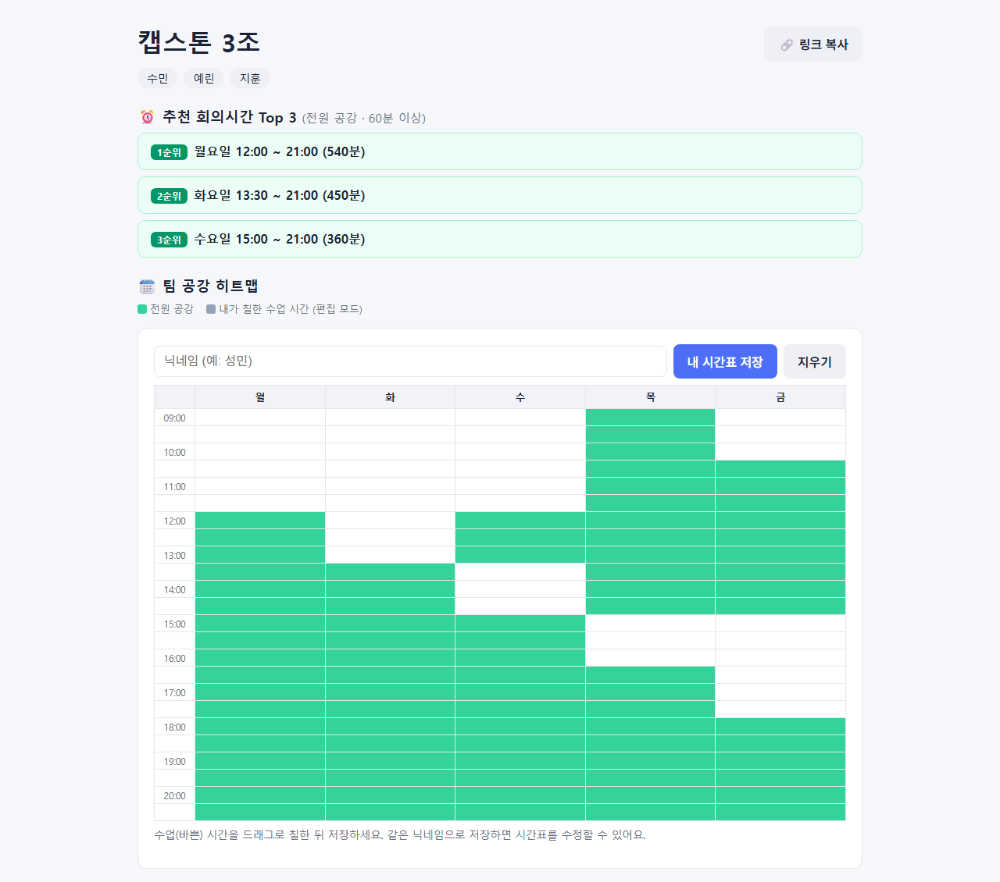

<div align="center">

# 🗓️ 공강밋 (Gonggang-Meet)

**"팀플 회의, 언제 할래?" 를 3초 만에 끝내는 법**

각자 **수업 시간표만 입력하면**, 팀 전원이 겹치는 공강을 자동 계산해
회의 시간 **Top 3**를 추천해주는 웹 서비스


</div>

---

## 😩 이런 적 있지 않나요?

> 단톡: "다들 언제 시간 돼?"
> → 12시간 뒤 답장 2개 → 아무도 정리 안 함 → 결국 밤 10시 줌 회의

When2meet 같은 툴은 매번 "되는 시간"을 새로 칠해야 합니다.
하지만 대학생의 빈 시간은 **시간표가 이미 알고 있죠.**

공강밋은 반대로 갑니다 — **수업 시간을 칠하면, 공강은 자동으로 계산됩니다.**
한 학기 내내 유효한 시간표 기반이라 **한 번 입력하면 매주 재사용**할 수 있어요.

## ✨ 미리보기

| 방 만들기 | 팀 공강 히트맵 + 추천 Top 3 |
|:---:|:---:|
|  |  |

## 🚀 사용 흐름

1. **방 생성** — 팀 이름 입력하면 고유 링크 발급 (`/r/<랜덤토큰>`)
2. **링크를 팀 단톡에 공유** — 로그인, 회원가입 없음
3. **각자 시간표 입력** — 닉네임 쓰고, 주간 그리드(월~금 09:00~21:00)에 수업 시간을 드래그로 칠하고 저장
4. **끝** — 전원 공강 히트맵과 60분 이상 연속 공강 기준 **추천 회의시간 Top 3**가 실시간으로 뜸
5. 시간표 바뀌면 같은 닉네임으로 다시 저장 (덮어쓰기)

## 🛠️ 실행 방법

```bash
git clone https://github.com/nohseongmin/gonggang-meet.git
cd gonggang-meet
pip install -r requirements.txt
python -m uvicorn app.main:app --port 8377
# 브라우저에서 http://127.0.0.1:8377 접속
```

별도 DB 설치 불필요 — 첫 실행 시 SQLite 파일(`gonggang.db`)이 자동 생성됩니다.

## 📁 프로젝트 구조

```
gonggang-meet/
├── BLUEPRINT.md        # 시장조사 · BM · 보안 · MVP 범위 블루프린트
├── requirements.txt
└── app/
    ├── main.py         # FastAPI: 방/시간표 API + 공강 교집합·추천 알고리즘
    └── static/
        ├── index.html  # 랜딩 (방 생성)
        ├── room.html   # 방 페이지 (그리드 · 히트맵 · 추천)
        ├── room.js     # 드래그 입력, XSS-safe 렌더링
        └── style.css
```

### 추천 알고리즘 (요약)

팀원들의 수업 슬롯 합집합을 구한 뒤, 요일별로 **전원이 비는 연속 블록**을 스캔합니다.
60분 이상인 블록만 후보로 삼고 ① 길이 ② 이른 요일/시간 순으로 정렬해 Top 3를 뽑습니다.
([app/main.py](app/main.py)의 `compute_recommendations`, 슬롯은 30분 단위 인덱스)

## 🔒 보안

바이브코딩이어도 보안은 기본값입니다:

- **SQL 인젝션 방어** — SQLite 파라미터 바인딩만 사용
- **입력 검증** — 닉네임/방제목은 Pydantic으로 길이·문자 화이트리스트 검증, 슬롯 인덱스 범위 검증 (위반 시 422)
- **XSS 방어** — 유저 입력은 항상 `textContent`로 렌더링, `innerHTML` 미사용
- **추측 불가능한 방 링크** — `secrets.token_urlsafe` 기반 랜덤 토큰
- **정보 노출 차단** — 전역 예외 핸들러로 스택트레이스 등 내부 정보 비노출
- **최소 수집** — 닉네임(가명 가능) + 시간표 슬롯만. 이메일 · 학번 · 실명 안 받음

## 🗺️ 로드맵

- [x] MVP: 방 생성 → 시간표 입력 → 공강 히트맵 + 추천 Top 3
- [ ] 무료 티어 배포 (Render / Fly.io) + 실사용 팀 검증
- [ ] 에브리타임 시간표 붙여넣기 파서
- [ ] 회의 시간 투표 · 확정, 카톡 공유 카드
- [ ] 주말 · 야간 시간대 확장

시장 분석과 수익모델 설계는 [BLUEPRINT.md](BLUEPRINT.md)에 정리되어 있습니다.

## 📄 라이선스

MIT
